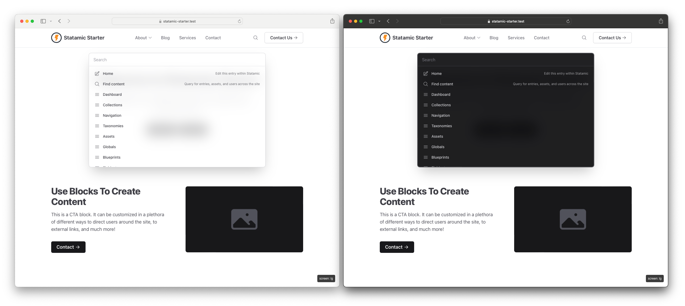

#  Palette
⌨️ CMD+K your way around Statamic!

## 🤔 What is Palette?

Palette allows you to easily jump between areas, entries, assets, and users within Statamic without lifting your hands off the keyboard!

If you're a developer, you likely use something like [Raycast](https://www.raycast.com/), [Alfred](https://www.alfredapp.com/), or [Spotlight](https://support.apple.com/guide/mac-help/search-with-spotlight-mchlp1008/mac).

That should also exist in the CMS you use most, right? With Palette you can now jump around with ease!



## ⚡️ Features
- 🔍 Available on the front-end and in the control panel
- 🌗 Light and dark mode support
- ⭐️ Zero setup necessary; just install and enable
- 🏎 Compatible with full-page static caching strategies like [Blitz](https://putyourlightson.com/plugins/blitz)
- 🔐 Actions change based on user permissions and if admin changes are allowed
- 🎛️ Change contexts to filter actions or search your content
- 🔌 Plugins that register navigation links, settings areas, and utilities are included automatically
- 💅 Add your own custom URLs via the config file

## 📦 Installing

- Run `composer require trendyminds/statamic-palette`
- Publish the config file by running `php artisan vendor:publish --tag="palette-config"`
- Add the following right before your closing `</body>` in your main layout file:

```html
<!-- if Antlers -->
{{ palette }}

<!-- if Blade -->
{{ Statamic::tag('palette')->fetch() }}
```

## 🤝 Contributing

If you would like to contribute to Palette we tried to make it as easy as possible:

1. Clone the repo
2. Run `npm i` to install the Node dependencies
3. Run `npm run dev` to begin the watch task
4. Make your changes
5. Run `npm run build` to compile and minify the CSS and JS
6. Submit a PR!
